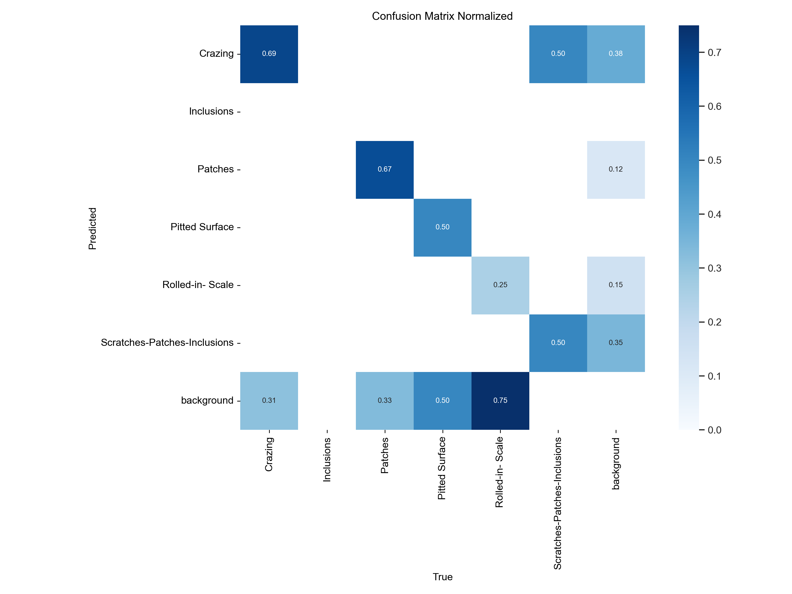

# Object Detection for Surface Defect Detection Dataset
### public dataset : https://universe.roboflow.com/metal-surface-defects/surface-defect-detection-boivj/dataset/2#

In this repo, I try to did the object detection using yolov11 algorithm to detect the surface defect. 
The dataset contains of 126 images, meanwhile the class are 5, namely as: 
<ul>
  <li>Crazing</li>
  <li>Inclusion</li>
  <li>Pitted surface</li>
  <li>Rolled</li>
  <li>Scratching</li>
</ul>
<h1>EDA Dataset</h1>
<h1>Detection</h1>
<h1>Results</h1>

    
    
This is an example of how to display an image using HTML.

